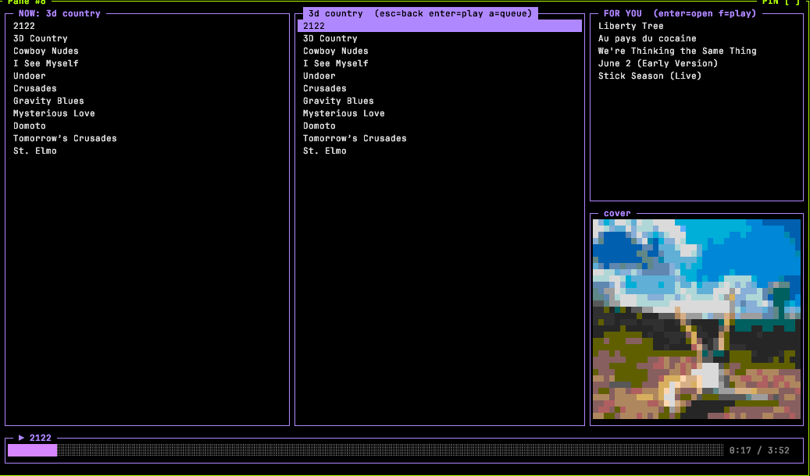

# msm — YouTube Music + local library terminal player

Browse YouTube Music and your local `~/Music` library in the terminal, play
through `mpv`, and scrobble every track to Last.fm through `cmusfm` (the same
protocol cmus uses for its `status_display_program`). mpv runs in the
background, driven over its JSON IPC socket, so the TUI owns the terminal.
Album art is drawn as pixelated 256-colour half-blocks, so it works in any
256-colour terminal and needs no image protocol.

A single Rust binary. No Python, no runtime.

<p align="center">
  
</p>
<p align="center">
  
  
</p>

## Requirements

Install these separately; they must be on `PATH`:

- `mpv`: playback
- `yt-dlp`: downloads YouTube tracks into a local cache before playback
- `cmusfm`: Last.fm scrobbling. Configure it for your Last.fm account first
  (`cmusfm init`).
- `ffmpeg` / `ffprobe`: local tags, embedded cover art, and decoding art for display

On macOS:

```sh
brew install mpv yt-dlp ffmpeg cmus cmusfm
```

Building needs a Rust toolchain (<https://rustup.rs>).

## Install

```sh
cargo install --git https://github.com/markvrma/yt-music-cli   # straight from git
cargo install --path .                                          # from a local clone
```

Either way the binary lands in `~/.cargo/bin/msm`. Run it from anywhere:

```sh
msm
```

Upgrading from the old Python version? Run `pipx uninstall msm-player` (or
`pip uninstall msm-player`) so only one `msm` is on `PATH`. Auth, history, art
and the download cache are all kept and read unchanged.

## Sign in to YouTube Music (optional)

Without signing in, msm searches and plays anonymously. Signing in:

- records your plays to your YouTube Music history
- turns on `L` (like)
- swaps the **LAST 5** pane for personalized **FOR YOU** recommendations

msm uses browser-session auth: you copy one request from a logged-in
`music.youtube.com` tab. YouTube's API rejects ordinary Google OAuth tokens for
these endpoints, so no Google Cloud project is involved.

1. Open <https://music.youtube.com> in your browser, logged in (not incognito).
2. Open DevTools (⌥⌘I), go to the **Network** tab, and filter for `/browse`.
3. Right-click any `POST` request, then **Copy → Copy as cURL**.
4. Run:

   ```sh
   msm auth
   ```

   It reads the copied request straight from the clipboard. If the clipboard is
   empty, it asks you to paste and then press **Ctrl-D**. `msm auth <file>` reads
   the request from a file instead.

It accepts **Copy as cURL**, **Copy request headers**, or Chrome's alternating
name/value lines. It writes `~/.config/ymc/browser.json` with mode 600, since the
file holds your session cookies. It then checks that YouTube really treats the
session as logged in, and warns you if it doesn't.

Plays are recorded to YouTube Music once a track has played for 30s. Last.fm
scrobbling through cmusfm carries on alongside. If recommendations or history
stop working later, the session has expired: run `msm auth` again.

## Screens

Bordered panes in a purple and grey theme, with a progress bar along the bottom
of every screen.

### browse

- **NOW** (left): the tracklist of the opened album.
  - `enter` plays from the highlighted track.
  - `f` plays from the first track.
  - `a` / `A` queue the highlighted track.
- **LOCAL ~/Music** (middle): your local albums, one per subfolder.
  - `enter` opens the album's tracklist in place (second screenshot). Inside it:
    - `enter` plays that one track.
    - `f` plays the album from the highlighted track.
    - `a` / `A` queue the highlighted track.
    - `Esc`, or any key that leaves the pane (`h`, `l`, `/`), goes back to the album list.
  - `f` plays an album from its first track.
- **LAST 5 / FOR YOU** (top right): the last 5 albums you played, or YouTube
  Music recommendations when you're signed in.
  - `enter` loads one into NOW.
  - `f` loads and plays it.
- **cover** (bottom right): the art of the track that's playing. It follows the
  track across queued albums.
  - Local albums use `cover.jpg`, `folder.jpg`, or any other image in the
    folder, and fall back to the art embedded in the first track.

### search

Press `/`, type a query, then press `enter`. Results come back as songs, then
albums, then playlists (the top 5 of each), tagged `[song]`, `[album]` or
`[playlist]` with the artist.

- `j` / `k` pick a result.
- `enter` loads it into NOW without playing.
- `f` loads and plays it.
- `a` / `A` queue it and keep you on the search screen.
- `h` goes back to the query box.
- `Esc` goes back to browse.

### Progress bar

The label shows `▶` while playing or `‖` while paused, followed by the track
title. Short messages such as `♥ liked: …` or `⏭ queued: …` briefly take over
the label.

These flags appear in front of the label while a mode is on:

| flag | meaning |
|---|---|
| `↻` | repeat-all |
| `◐` | left-ear-only |
| `NN%` | msm's volume, shown only when it isn't 100% |

## Keys

| key | action |
|---|---|
| `h` / `l` | switch pane (NOW ↔ LOCAL ↔ LAST 5 / FOR YOU) |
| `j` / `k`, `↓` / `↑` | move |
| `enter` | open / play (see [Screens](#screens)) |
| `f` | play from the start |
| `space` | pause / resume |
| `n` / `p` | next / previous track |
| `a` | queue: play after everything already queued |
| `A` | play next: right after the current track, rest of the queue untouched |
| `r` | repeat-all (see below) |
| `e` | left-ear-only: music folded into the left channel, right channel silent |
| `[` / `]` | volume −5 / +5. This is msm's own mpv volume; the system mixer and other apps are untouched. |
| `L` | like the highlighted track, or the playing track (needs sign-in) |
| `/` | search |
| `Ctrl-Z` | suspend msm and mpv (music stops). Resume with `fg`. |
| `q`, `Ctrl-C` | quit |

**Repeat-all (`r`):**
- After the last track, playback restarts at track 1.
- `n` / `p` wrap around the ends.
- The next album you play keeps the setting.

Like `space`, `n` and `p`, `r` works on the browse screen, not inside search results.

## Files

| path | what |
|---|---|
| `~/.config/ymc/browser.json` | YouTube Music session headers (`msm auth`), mode 600 |
| `~/.config/ymc/history.json` | last 5 albums played |
| `~/.config/ymc/art/` | cached album art |
| `~/.cache/msm/<videoId>.m4a` | downloaded YouTube tracks. Never cleared automatically; delete it to reclaim space. |
| `/tmp/ymc-mpv.log` | verbose mpv log; check it when playback fails |

Local albums are read from `~/Music`, one album per subfolder. Supported files:
`mp3 flac m4a opus ogg wav aac wma`. Tags come from `ffprobe`, and the files
play straight from disk.

YouTube tracks are downloaded with `yt-dlp` using your browser's cookies. That
browser is Chrome by default; set `MSM_COOKIE_BROWSER` to use another one
(`firefox`, `safari`, `brave`, …).

## Develop

```sh
cargo run                         # build + run the TUI
cargo test                        # self-checks: no network, no mpv, no terminal needed
cargo test -- --ignored           # also live checks: network, real mpv + yt-dlp (plays audio)
cargo clippy --all-targets
cargo build --release             # -> target/release/msm
```

The live checks start a real mpv and restart cmusfm. Quit any running msm
first, because they share `/tmp/ymc-mpv.sock`.
