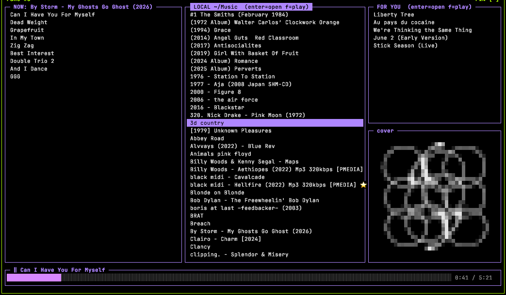
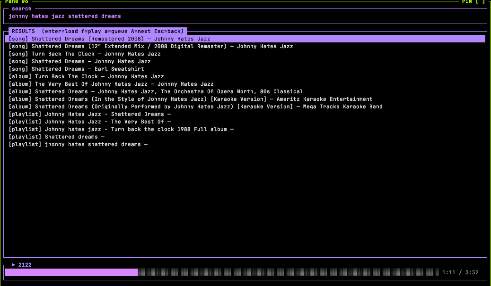

# msm — YouTube Music + local library terminal player

Browse YouTube Music and your local `~/Music` library in the terminal, play
via `mpv`, scrobble each track through `cmusfm` (same protocol cmus uses as
its status_display_program). mpv runs in the background driven over its JSON
IPC socket, so the TUI owns the terminal.

<p align="center">
  
  
</p>

## System requirements (install separately)

- `mpv`, `yt-dlp`, `cmusfm`, `ffmpeg`/`ffprobe` on PATH (ffprobe reads local tags; ffmpeg extracts embedded art)
- cmusfm configured for last.fm (its daemon must be running — it is whenever
  cmus has run with `status_display_program=cmusfm`)

On macOS: `brew install mpv yt-dlp ffmpeg cmus cmusfm`

## Install

```sh
cargo install --path .            # from a local clone -> ~/.cargo/bin/msm
cargo install --git https://github.com/markverma/msm-player   # straight from git
```

Then run the TUI from anywhere:

```sh
msm
```

Coming from the Python version? `pipx uninstall msm-player` (or `pip uninstall
msm-player`) so only one `msm` is on PATH. Config, history, auth and the
download cache are shared unchanged.

## Sign in to YouTube Music (optional)

Without sign-in, msm searches and plays anonymously. Sign in to record your
plays to your YouTube Music listening history and get a personalized **FOR YOU**
pane (replacing **Last 5**).

msm uses ytmusicapi's *browser auth* — you paste the request headers from a
logged-in `music.youtube.com` tab once. (YouTube's API rejects normal Google
OAuth tokens for these endpoints, so this is the only method that works; no
Google Cloud project needed.)

```sh
msm auth
```

Then, when prompted:

1. Open <https://music.youtube.com> logged in, in your browser
2. Open DevTools (⌥⌘I) → **Network** tab, filter for `/browse`
3. Click any `POST` request → **Copy** → **Copy request headers**
4. Paste into the terminal, then press **Ctrl-D**

This writes `~/.config/ymc/browser.json` (chmod 600 — it holds your session
cookies). Plays are recorded to YouTube Music once a track has played 30s
(Last.fm scrobbling via cmusfm continues alongside). If recs/history stop
working later, the session expired — just run `msm auth` again.

## Develop

```sh
cargo run                         # build + run the TUI
cargo test                        # self-checks (no network, no mpv, no terminal)
cargo test -- --ignored           # + live checks: network, real mpv/yt-dlp (plays audio)
cargo build --release             # -> target/release/msm
```

Two screens:

Bordered panes, purple/grey theme.

**browse** — five panes:
- **Now Playing** (left, tall): tracklist of the opened album — `enter` plays a track, `f` plays the album from start
- **Local ~/Music** (middle, tall): your local albums (one per subfolder) — `enter` opens its tracklist into Now Playing, `f` opens + plays
- **Last 5 / FOR YOU** (top-right): recently played albums, or — when signed in — personalized YouTube Music recommendations — `enter` opens into Now Playing, `f` opens + plays
- **cover** (bottom-right): pixelated album art of the Now Playing album (square, 256-color half-block; local art from folder `cover.jpg`/`folder.jpg` or embedded tag)
- progress bar (bottom, full width)

Opening an album (from Local or Last 5) loads its tracklist into **Now Playing** and moves focus there.

**search** — press `/`:
- type a query, `enter` runs it; results tagged `[album]`/`[song]`/`[playlist]` with artist
- `j`/`k` pick; `enter` loads into Now Playing (no play); `f` loads + plays; `Esc` back

Keys: `h`/`l` switch pane (Now Playing ↔ Local ↔ Last 5) · `j`/`k` move · `enter` open/play ·
`f` play from start · `space` pause · `n`/`p` next/prev · `a` queue · `shift`+`A` play next ·
`r` repeat-all · `shift`+`L` like current track (YT, signed in) · `/` search · `q` quit.

`r` toggles repeat-all: after the last track playback restarts at track 1, `↻` shows in the
progress bar, `n`/`p` wrap around the ends, and the next album played inherits the setting.
Like `space`/`n`/`p` it works on the browse screen, not inside search results.

Local albums use `ffprobe` for tags (title/artist/album/duration) and play straight from disk.
Play history persists to `~/.config/ymc/history.json` (last 5 albums).
